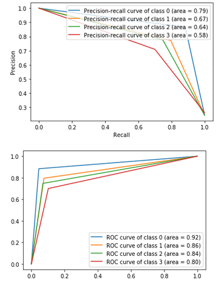

# Pràctica Kaggle APC UAB 2021-22
### Nom: David Aguilera Luzón
### DATASET: Classify gestures by reading muscle activity.
### URL: [kaggle] https://www.kaggle.com/kyr7plus/emg-4

## Resum
El
dataset utilitza les dades recollides per 8 sensors col·locats al braç d'una persona en diferents posicions mentres aquesta realitzava un dels següents gestos:
- pedra (puny tancat)
- tissora (dit índex i mig estirats)
- paper (tots els dits estirats)
- ok (polze i índex tocant-se, la resta tancats)

Les mesures es van prendre en 8 tandes.
Per tant tindre 1 columna per a cada sensor durant cada una de les tandes, és a dir, tindrem 64 columnes.
Això més una columna que indiqui el gest resultant: 0 per roca, 1 per tissora, 2 per paper i 3 per ok.
Per el que fa a les files, es van prendre les mesures mantenint el gest 6 vegades durant 20 segons per a cada tanda, i es prenia un registre cada 40ms.
Per tant s'han registrat 3000 mesures per a cada sensor.
És a dir, hiha 3000 files per a cada gest.
Per tant, el dataset serà de 65 columnes x a 12000 files.

### Objectius del dataset
Poder classificar de quin gest es tracta a partir de l'entrada dels sensors.

### Experiments
Durant aquesta pràctica he provat els següents algoritmes:
KNN, Decission-tree i Classificació logísitca amb 4 tipus de kernel.

### Preprocessat
Com les dades venien donades en 4 arxius diferents, primer he necessitat juntar-les totes en un sol dataset, per a poder entrenar els classificadors correctament.
Ja que si només ho feia amb un dels arxius solament podria classificar auqell gest en concret.
Per això els he ajuntat i per a facilitar treballar amb les dades he afegit headers a les columnes.
Després he comprovat la dimensionalitat del dataset generat per veure que és com toca.
Hi ha menys columnes de les esperades, per això també miro el número de mesures per a cada gest i trobo que no hi ha cap que arribi a les 3000.
Això es deu a algún error al moment de prendre les mesures, de totes maneres, com tots els gestos tenen aproximadament el mateix número de mostres, no crec que calgui afegir ni borrar dades de cap gest.
En total tenim: 65 columnes x 11674 columnes.

Després vaig mirar si teniem valors nulls per a borrar-los, però no hi havia.
Finalment vaig comprovar la desviació estándard que és de: 17.23%
Com és un número relativament baix indica que els valors estan agrupats, per això crec que no val la pena buscar els outliers ni borrar-los, ja que són pocs i de tota manera poden ajudar a entrenar per classificar millor.

### Model
Models:
|Model|Hiperparametre|Mètrica|Temps segons|
Logistic Regression Kernel = linear|train_size = [0.3,0.5,0.7,0.8], C=1.0, fit_intercept=True, penalty='l2'|score=[0.34,0.35,0.35,0.33]|temps=[0.49,1.35,3.07,5.23]
Logistic Regression Kernel = poly|train_size = [0.3,0.5,0.7,0.8], C=1.0, fit_intercept=True, penalty='l2'|score=[0.33,0.34,0.34,0.34]|temps=[0.64,1.84,3.84,5.76]
Logistic Regression Kernel = rbf|train_size = [0.3,0.5,0.7,0.8], C=1.0, fit_intercept=True, penalty='l2'|score=[0.34,0.35,0.35,0.33]|temps=[0.41,1.20,2.69,4.45]
Logistic Regression Kernel = sigmoid|train_size = [0.3,0.5,0.7,0.8], C=1.0, fit_intercept=True, penalty='l2'|score=[0.34,0.33,0.36,0.33]|temps=[0.42,1.23,3.03,5.06]

Decission Tree|train_size = [0.3,0.5,0.7,0.8], random_state=0|mean accuracy=0.77|temps=[4.60,3.02,2.00,1.42]

KNN|train_size=0.7, numero vecinos = [1,2,3,4,5,6,7,8,9]|Accuracy = [1,0.84,0.78,0.77,0.75,0.73,0.73,0.72,0.71], Precission = [1,0.84,0.78,0.77,0.75,0.73,0.73,0.72,0.72], Recall = [1,0.84,0.78,0.77,0.75,0.73,0.73,0.72,0.71]|temps = [0.61,9.2,9.3,9.4,9.1,9.4,9.4,9.4,10.7]

## Demo
Per tal de fer una prova és pot fer amb l'arxius demo.py, dins la carpeta "Demo".
Aquest arxiu executa una versió de les proves però amb un dataset reduït, de 500 files per a cada gest.

## Conclusions
El millor model que he trobat és el Decission-tree amb un train-size del 30% de les dades.
De fet quan major el train-size pitjor classifica.
La resta de models provats classifican quasi igual de bé, exceptuant la Regressió Logística que té una performance del 30% en general.
En el cas del KNN amb pocs veïns també dona molt bon resultat però clar, pot ser atzar degut a que casualment triï el veí correctes.
És per això que amb KNN el resultats que mirem són els dels 6-7-8-9 veïns, i tot i ser bons el decission-tree segueix sent el millor.

Del Decission-tree he mirat les corves de Precision-Recall i ROC curve. Classifica aproximadament igual totes les classes però té problemes per fer-ho amb la classe de paper.
Crec que la classe que millor classifica és roca ja que és la que té els dits més diferents respectivament als altres gestos, ja que estan tots tancats.
En canvi, tissora té molta semblança amb l'ok i paper, ja que té dits oberts i això crec que pot fer que tingui valors semblants i per tant costa de classificar.

## Idees per treballar en un futur
En un futur es podria probar a juntar les columnes que siguin del mateix sensor en una sola.
Així tindriem les dades més concentrades i solament 8 columnes per treballar, el que podria millorar el temps de resposta i els resultats.
